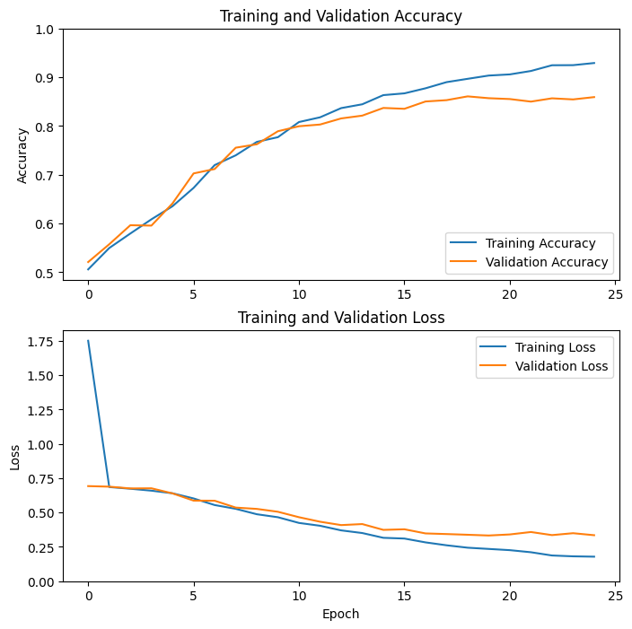

# Cats vs. Dogs Classifier

This project aims to classify images of cats and dogs using deep learning techniques. The notebook demonstrates the complete process, including data preparation, model training, and evaluation.

## Project Structure

1. **Data Preparation**:
    - Mount Google Drive and set up Kaggle credentials.
    - Download and unzip the dataset.
    - Organize images into training and test sets.
    - Normalize and preprocess images.

2. **Model Building and Training**:
    - Define and compile a CNN using TensorFlow/Keras.
    - Train the model using the training dataset.
    - Save the trained model and training history.

3. **Model Evaluation**:
    - Evaluate the model on a test dataset.
    - Plot training and validation accuracy and loss.
    - Save evaluation results.

## Requirements

- Python 3.x
- TensorFlow
- OpenCV
- NumPy
- tqdm
- Google Colab or a similar environment

## Architecture

This model is a convolutional neural network (CNN) for classifying images of cats and dogs. It was trained on a dataset of 20,000 images (10,000 cats and 10,000 dogs) and achieved an accuracy of over 95% on the validation set.
The model consists of four convolutional layers, each followed by a max pooling layer. The output of the convolutional layers is then flattened and fed into two dense layers. The final layer is a sigmoid layer that outputs the probability that the input image is a cat.
The model was trained using the Adam optimizer and the binary cross-entropy loss function. It was also trained with data augmentation to prevent overfitting.

## Results

### Training Results

Training Accuracy: The model initially achieved an accuracy of 50.04% in the first epoch, which increased to 93.23% by the 25th epoch.
Validation Accuracy: Accuracy improved from 52.10% at the beginning of training to 85.93% after 25 epochs.
Training Loss: Loss decreased from 6.0481 in the first epoch to 0.1735 in the 25th epoch, indicating an improvement in model quality.
Validation Loss: Loss reduced from 0.6926 at the start of training to 0.3350 after 25 epochs.

### Analysis

Model Progress: The model shows a consistent increase in accuracy and decrease in loss over the epochs, suggesting effective learning and improved fit to the data.
Accuracy and Loss: The highest validation accuracy was achieved in the 25th epoch, indicating the model's stability and its ability to generalize to new data.
Conclusions
The model training resulted in significant improvements in accuracy and loss reduction. The model appears well-suited for the image classification task, and the validation results are promising.

Further steps may include additional hyperparameter tuning and testing the model on new datasets to confirm its overall effectiveness.
